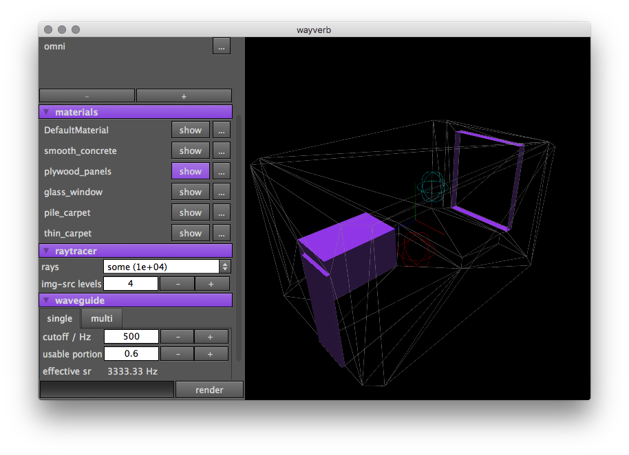
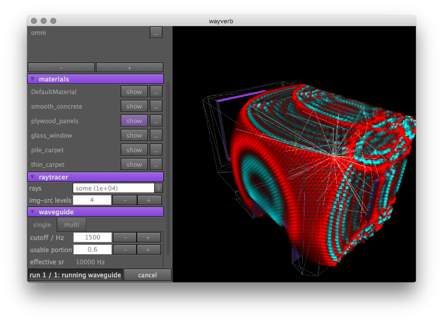

<section id="sidebar">

<nav>
<ul>
<li><a href="#intro">Welcome</a></li>
<li><a href="#one">Overview</a></li>
<li><a href="#two">Details</a></li>
<li><a href="#three">Download</a></li>
<li><a href="#four">Background</a></li>
</ul>
</nav>

</section>

<section id="intro" class="wrapper style1 fullscreen fade-up">

# Wayverb

realistic, fast impulse-response synthesis
 
free and open source

<ul class="actions">
<li><a href="#one" class="button scrolly">Learn more</a></li>
</ul>

</section>

<section id="one" class="wrapper style2 spotlights">

<section>

## What is Wayverb?

Given a 3D model of a room (perhaps made with [Sketchup](https://www.sketchup.com)
or [AutoCAD](http://www.autodesk.com/products/autocad)), Wayverb allows you to
simulate the impulse response of that room.
Simulations can be customised by adjusting the frequency response of the
reflective surfaces, and the source and microphone positions.

Generated impulse responses are primarily designed for use with convolution
reverb tools such as [Altiverb](https://www.audioease.com/altiverb), for use in
music production and sound design.
They may also be useful to architects, for checking the acoustic properties of
spaces (such as reverb time and speech intelligibility), without having to
physically build anything.

<ul class="actions">
<li><a href="/demos/" class="button">View demos</a></li>
</ul>

</section>

<section>

## How does it work?

The simulator combines an image-source model for precise early reflections,
a statistical ray-tracing model for fast envelope prediction, and a
physically-based waveguide model for low frequencies.
This combination provides a good balance between accuracy and simulation speed.

<ul class="actions">
<li><a href="#two" class="button scrolly">Learn more</a></li>
</ul>

</section>

</section>

<section id="two" class="wrapper style3 fade-up">

## Implementation details

You can jump straight to the documentation on each of these topics, or you can
start by reading from the beginning.

<section>
### [Image-source early reflection finder](/image_source/)
Early reflections are found using the image-source method, retaining accurate
directional and temporal information.
</section>

<section>
### [Ray-tracing late reflection estimator](/ray_tracer/)
Late reflections are found using a statistical ray-tracing method, which
estimates the envelope of the late energy decay.
</section>

<section>
### [Waveguide low-frequency simulator](/waveguide/)
Low frequencies are found by modelling the change in air pressure over time,
taking into account wave effects such as reflection, interference, and
diffraction.
</section>

<section>
### [Hybrid](/hybrid/)
The three simulation methods are automatically and seamlessly combined to
produce a single result.
</section>

<section>
### [Microphone modelling](/microphone/)
Replicate traditional microphone set-ups to mimic a concert-hall recording,
or use the built-in HRTF functionality to produce binaural impulse responses.
</section>

<section>
### [Boundary modelling](/boundary/)
Modify the frequency response of any surface in the model.
Each surface has 8-band absorption and scattering parameters, which can be used
to mimic real materials - or you can invent your own.
</section>

<ul class="actions">
<li><a href="/prelude/" class="button">Go to detailed documentation</a></li>
</ul>

</section>

<section id="three" class="wrapper style1 fade-up">

## Download

You'll need a machine running macOS 10.11, ideally with a discrete graphics card.

<ul class="actions">
<li><a href="https://github.com/reuk/wayverb/releases" class="button">Get Wayverb</a></li>
</ul>

</section>

<section id="four" class = "wrapper style2 fade-up">

## Background

Wayverb is written by [Reuben Thomas](https://github.com/reuk).

It is the product of a MA by Research in Music at [The University of Huddersfield](https://www.hud.ac.uk/),
supervised by [Alexander Harker](http://www.alexanderjharker.co.uk/), and
submitted January 2017.

The code is free and open-source, licensed under the terms of the GNU GPL v2.
You can find it [here](https://github.com/reuk/wayverb).

</section>

