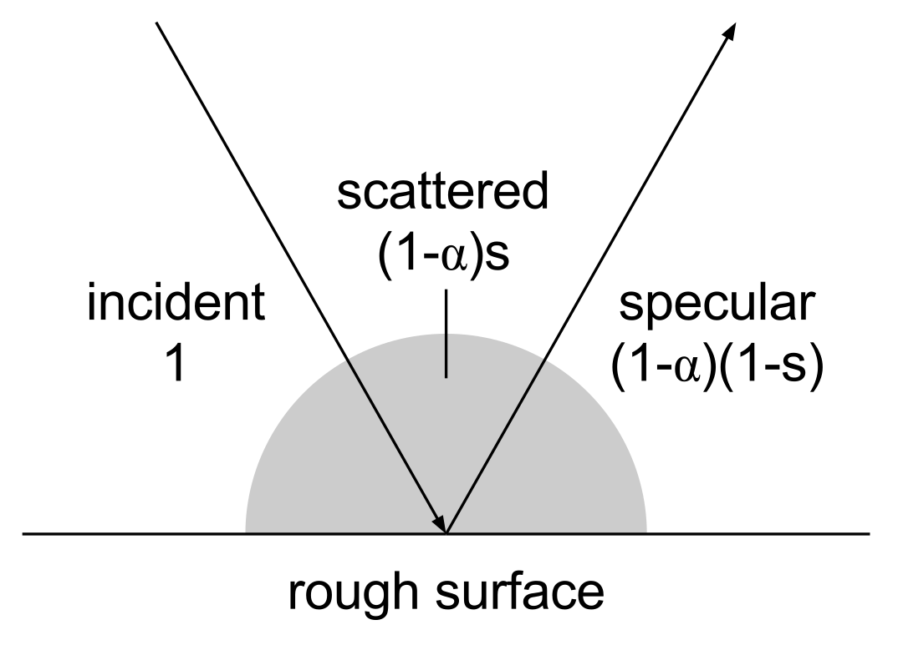
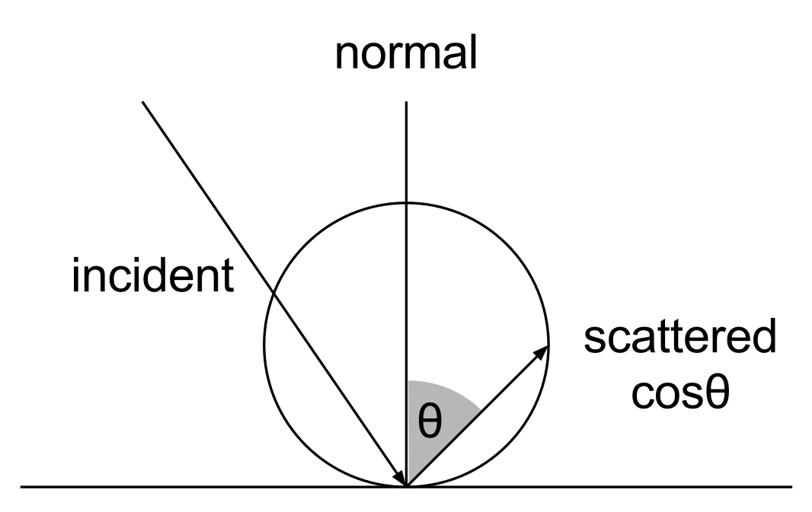

---
reference-section-title: References
...

# Boundary Modelling {.major}

## Introduction

The ideal boundary model would allow complete control over the frequency- and direction-dependent absorption and scattering of a surface.
Though this is reasonably straightforward in geometric models, it is far from a solved problem for the digital waveguide mesh (DWM).
Several possible implementations are discussed in the literature, each with unique drawbacks.

This section will begin by discussing the ideal behaviour of modelled acoustic boundaries.
Then, the implementation for geometric models will be discussed.
Possibilities for DWM boundary models will be investigated, and the final choice of method explained.
The geometric and DWM implementations will be evaluated and compared, to ensure equivalence.

## Background

The books by @vorlander_auralization:_2007 [p 35] and @kuttruff_room_2009 [p 35] both devote entire chapters to the topic of sound reflection and scattering.
Please refer to these books for a detailed and broad explanation of reflection effects.
To avoid unnecessary duplication, this background will be brief, aiming only to put terminology and decisions in context.

In acoustic simulation, incident waves are generally considered to be plane waves.
This simplifies most calculations, but the source of the wave must not be far enough from any reflecting surface that the curvature of the wave-front is negligible.

### Magnitude and Phase

The reflection factor $R$ is a complex value given by $R=|R|exp(i\chi )$, which describes a modification to the amplitude and phase of the reflected wave ($|R|$ is the magnitude term, $\chi$ is phase).
This factor depends both on the frequency and direction of the incident wave.
When $\chi = \pi$, $R=-1$, corresponding to a phase reversal.
This is known as a 'soft' wall, but is rarely seen in room acoustics.
It is reasonable to assume that reflections are in-phase in the majority of problems.

The wall impedance $Z$ is defined as the ratio of sound pressure to the normal component of particle velocity at the wall surface.
It is related to the reflection factor by $R=\frac{Z\cos\theta-Z_0}{Z\cos\theta+Z_0}$, where $\theta$ is the angle of incidence, and $Z_0$ is the characteristic impedance of the propagation medium, normally air.
In the case that the wall impedance is independent of the wave angle-of-incidence, the surface is known as *locally reacting*.
A locally reacting surface does not transmit waves tangentially along the wall surface.

The absorption coefficient $\alpha$ of the wall is related to the reflection factor by the equation $\alpha =1-|R|^2$, which describes the incident energy lost during reflection.

Surfaces in an acoustic simulation may be described fully by either the reflection factor or wall impedance.
The absorption coefficient fails to encode the phase-change properties of the surface, and so cannot fully describe its acoustic properties.
It is, however, acceptable if surfaces are assumed to be 'hard', i.e. they do not induce phase changes.

### Scattering

The reflection factor, absorption coefficient, and wall impedance describe the behaviour of perfectly-reflected (specular) waves.
If the reflecting surface has imperfections or details of the same order as the wavelength, as many surfaces in the real world do, then some components of the reflected wave will be *scattered* instead of specularly reflected.

Describing the nature of the scattered sound is more complicated.
A common method is to use a *scattering coefficient*, $s$, which describes the proportion of outgoing energy which is scattered, and which may be dependent on frequency:

$E_{\text{scattered}}=E_{\text{incident}}(1-\alpha)s, E_{\text{specular}}=E_{\text{incident}}(1-\alpha)(1-s), E_{\text{total}}=(1-\alpha)$.

Alone, the scattering coefficient fails to describe the distribution of scattered energy.
In the case of an ideally-diffusing surface, the scattered energy is distributed according to Lambert's cosine law.
That is, the intensity depends only on the cosine of the outgoing scattering angle, and is independent of the angle of incidence.
More complex scattering distributions, which also depend on the outgoing direction, are possible [@christensen_new_2005; @durany_analytical_2015], but there is no single definitive model to describe physically-accurate scattering.

## Geometric Implementation

The geometric implementation is straightforward.
In both image-source and ray tracing methods, each ray starts with a certain intensity or pressure.
For specular reflections, the ray pressure must merely be multiplied by the wall reflection coefficient, which may derived from the absorption and scattering coefficients using the equations above.

If the reflection factor is dependent on the angle of incidence, this is simple to implement - just find the angle and use it to compute or look-up the correct value.

If the reflection factor is dependent on frequency, this is slightly more complicated.
The frequency range, and the pressure carried by the ray, must be discretised into bands.
Then each band must be modified using a representative reflection factor for that frequency range.
This is similar to the approach taken in graphical ray tracing, in which each ray carries separate red, green, and blue components.

By definition, image-source models find only image sources (i.e. specular reflections), so scattering is generally not implemented in these models.
Scattering can be implemented in ray tracers, but there is no consensus on the optimum method.
One option is to spawn two rays at every reflection: a specular ray, and a diffuse ray with random direction.
Though this properly replicates the theory, it leads to an explosion in the number of rays which must be traced, so is impractical in most cases.
A second option is to use a random choice, using the scattering coefficient as the probability, to decide whether the reflection should be specular or diffuse.
This solves the ray-explosion problem, but requires an additional random number to be generated per-reflection, which can be costly for large numbers of rays [@savioja_overview_2015].
An elegant solution is to simply mix the specular and diffuse rays together, using the scattering coefficient as a weighting [@rindel_use_2000].
This is the approach taken by Wayverb.
A major drawback of all these scattering methods is that the scattering coefficient can only be per-band if a separate ray is traced for each band.
If a single ray is used to carry all frequency components, then each component be scattered in exactly the same way.

The plain scattering model affects only the ongoing ray direction and amplitude.
However, it's worth considering that, at each reflection, the scattered energy may be directly visible to the receiver.
This fact is exploited by the *diffuse rain* technique, in which each reflection is considered to spawn a 'secondary source' which emits scattered energy towards the receiver.
This scattered energy is recorded only if the secondary source is visible from the receiver.

An equation for the magnitude of diffuse rain scattered energy is given by @schroder_physically_2011 [p 64], assuming perfect Lambert diffusion:

$E_{\text{scattered}} = E_{\text{incident}}(1-\alpha)2s\cos\theta(1-\cos\frac{\gamma}{2})$

Here, $\theta$ is the angle from secondary source to receiver relative against the surface normal, and $\gamma$ is the opening angle.
The magnitude of the scattered energy depends on the direction from the secondary source to the receiver (by Lambert's cosine law), and also by the solid angle covered by the receiver.

TODO partly occluded receiver

TODO diffuse rain diagram

## DWM Implementation

## Test Procedure

## Results

## Evaluation
