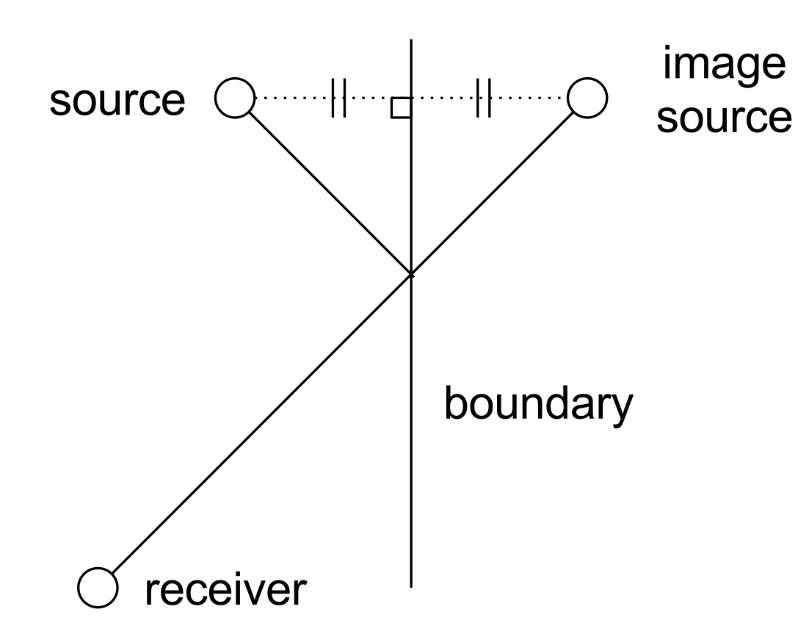

# Image-source {.major}

## Background

### Basic Method

The image-source method aims to find the purely specular reflection paths between a source and a receiver.
This relies on the simplifying assumption that sound propagates only along straight lines or "rays".
Sound energy travels at a fixed speed, corresponding to the speed of sound, along these rays.
The intensity of each "packet" of sound energy decreases with $1/r^2$, where $r$ is the distance along the ray that the packet has travelled [@vorlander_auralization:_2007, p. 58].

Rays are perfectly reflected at boundaries.
When a ray is reflected, it spawns a secondary source "behind" the boundary surface.
This source is located on a line perpendicular to the wall, at the same distance from it as the original source, as if the original source has been "mirrored" in the surface.
This is a first-order reflection.
A ray which is reflected from several boundaries is represented by a "higher-order" image-source, which has been mirrored in each of those boundaries in turn [@kuttruff_room_2009, p. 104].

All sources, original and image, emit the same impulsive source signal at the same time.
The total impulse response (i.e. sound pressure against time) is found by summing the signals from each source, delayed and attenuated appropriately depending on the distance between that source and the receiver.
The frequency response of the signal from each image source will additionally be modified depending on the characteristics of the boundaries in which that source was reflected.

### Validity Checks

Having found the position of an image-source, by reflecting it in one or more surfaces, it must be checked to ensure it represents a specular path to the receiver.
This is known as an *audibility test* [@vorlander_auralization:_2007, p. 202].

Consider first a source $S$, a receiver $R$, and a single wall $A$.
The source is reflected in $A$, creating an image-source $S_A$.
A line is constructed from $R$ to $S_A$.
If this line intersects $A$, then the $S_A$ represents a valid image source.
Otherwise, there is no possible specular reflection involving $S$, $R$ and $A$.

Now consider two walls, $A$ and $B$.
The image source $S_{AB}$ has been reflected in $A$ then $B$.
For the image-source to be valid, a line from $S_{AB}$ to $R$ must intersect $B$ at some point $B_\text{intersection}$, *and* a line from $S_A$ to $B_\text{intersection}$ must intersect $A$.

The validation of a third-order image-source will require three intersection checks, a fourth-order image will require four checks, and so on.

### Acceleration

The naive method to find all the image sources for a scene is very expensive.
Consider that to find a single first-order image source, the original source must be mirrored in a surface, and then an intersection test must be conducted between that surface and the image-source-to-receiver ray.
To find all first-order image sources, this process must be carried out for all surfaces in the scene.
To find all second-order image sources, each of those first-order images must be tested against every surface.
This continues for higher-order images, so that the number of checks for image sources of a given order is equal to the number of surfaces raised to the power of that order.
The relationship between the image-source order and the computation time is therefore exponential, meaning that high orders are impossible to compute in a reasonable time.

The majority of higher-order image sources found with the naive algorithm will be invalid.
That is, they will fail the visibility/intersection test.
For example, [@kuttruff_room_2009, p. 323] shows that, for tenth-order image-sources in a shoebox-shaped room, there are around 1.46e7 different image sources, only 1560 of which are valid.
If the invalid image-sources can be discarded early, without requiring individual checking, then the amount of computation can be greatly reduced to a viable level.

To accelerate the image-source process, [@vorlander_auralization:_2007] suggests tracing a large number of rays in random directions from the source, and logging the unique paths of rays which eventually intersect with the receiver.
Each unique path found in this way is used to generate an image source sequence, which is then checked as normal.
This technique has the advantage that the majority of surface sequences are *not* checked, so the image-source process is fast.
However, if the preliminary ray-tracer is not run with enough rays, it is likely to miss some valid paths, especially in complex scenes.
Additionally, if the receiver volume is too great, then some invalid paths may still be detected.

The technique used by Wayverb is similar to that presented in [@vorlander_auralization:_2007], but makes a small change.
A large number of random rays are traced, as before, but at each reflection point, the receiver is checked to see whether it is visible.
If it is, then the surface sequence is checked for a valid image-source.
This technique has two main advantages: more paths are checked, so it is more likely to find all the valid image-sources; and
ray paths don't have to be specular, so ray-tracing can use techniques like *vector-based scattering*.
The disadvantage is that a greater number of validity checks are required, though this number is still many times smaller than would be required by a naive implementation.

## Implementation

* tree
    * backtracking
* tie-in to ray-tracer
* sinc histogram
* multithreading
* behaviour at boundaries

## Testing

TODO compare "exact" method to new method in shoebox model
