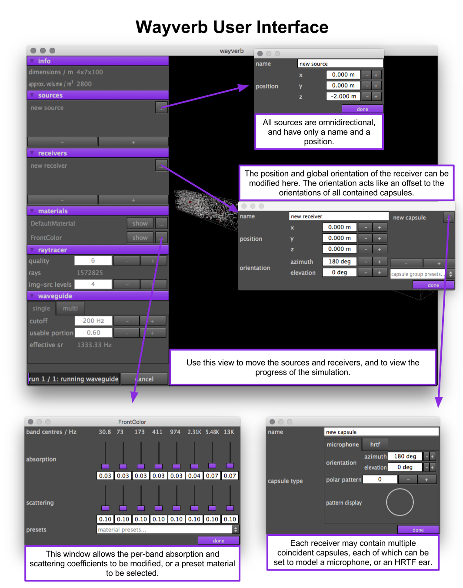

# Wayverb

**Hybrid waveguide and ray-tracing room acoustic simulator with GPU acceleration.**

# Synopsis

This project contains a library for offline room-acoustics simulations, along
with a graphical app which can be used to set-up and run these simulations.
The app produces room impulse responses, which can be used with convolution
reverbs to create realistic auralisations of virtual spaces.  Simulated room
impulse responses may be particularly useful for architects, sound-designers,
and musicians.

There are several common methods for simulating room acoustics, which can
largely be subdivided into two main categories:

- **Geometric methods** are fast but inaccurate, especially at low frequencies.
- **Wave-modelling methods** are much more accurate, but time-consuming to
  compute, especially at high frequencies.

As the strengths and weaknesses of the two methods balance one-another out, it
makes sense to combine both methods, so that wave-modelling is used to simulate
low-frequency output, and geometric methods are used to generate high-frequency
content.

The approach of this library is to use:

- **image-source** (a geometric method) for high-frequency early reflections,
- **stochastic ray-tracing** (another geometric method) for high-frequency late
  reflections, and
- **rectilinear waveguide mesh** (a wave-based method) for all low-frequency 
  content.

# Usage Notes

You'll need a 3D model of the space.  This model *must* be solid and
watertight, without holes or no-thickness planes.  When the simulation is run,
the waveguide mesh setup process will attempt to work out whether each node is
inside or outside the space, and it will not be able to do so if the model does
not have a well-defined inside and outside.

To ensure that your model is valid, you can:

1. Open the model in Sketchup.
2. Select-all and Edit > Make Group.
3. Check the info window (Window > Entity Info).
4. If this window displays a volume, it is correct.

If the model is not valid, you can debug it using the ['Solid Inspector'
plugin](https://extensions.sketchup.com/en/content/solid-inspector).

These instructions are taken from the readme for
[ParallelFDTD](https://github.com/juuli/ParallelFDTD), which uses a similar
(but not idential) technique to Wayverb for setting up a waveguide mesh.

Wayverb interprets the units used in the model file as metres. Some exporters
(like the Sketchup `.dxf` exporter) silently change the scale of the model
during export. For best results, it is recommended to export to `.obj` wherever
possible.
The following dialog shows optimum settings for the Sketchup Object exporter.

# Requirements

## Running

To run the program you will need:

- Mac OS 10.10 or newer
- GPU with double-precision support

While this project *might* work on a mac with integrated graphics, ideally you
should use a recent mac with a discrete graphics card.
You could be waiting a long time otherwise!

This project has been developed and tested on Mac OS 10.11.6, on a Mac with an
AMD GPU. It doesn't have any known bugs on this platform.

Some testing has been carried out on Mac OS 10.10, using an Nvidia GPU. On this
platform there were reasonably consistent crashes within OpenCL framework code.
These crashes are difficult to track down and have not been fixed, as the
author has been unable to secure extended access to a machine with this
Nvidia/10.10 configuration.

Some bugs are to be expected: if you find a bug, please file it using the
issues tab on the Github repository.

## Building

You will need:

- Mac OS 10.10 or newer
- Really recent Clang with C++14 support and experimental C++17 headers
  (development used Apple LLVM 8)
- CMake

Open `wayverb/Builds/MacOS/wayverb.xcodeproj` and build from there. All
dependencies should get downloaded and built automatically. **The initial build
will be really slow**, due to downloading and compiling a lot of libraries.
This is normal.

Unfortunately, some of the dependencies have their own dependencies. If
building fails, you may also need to install the following:

- autoconf
- autogen
- automake
- libtool
- pkg-config

If you have [Homebrew](http://brew.sh) installed, then you can grab everything
you might need by running this command:

    brew install cmake autoconf autogen automake libtool pkg-config

# Project Structure

## Important Folders

- **src**: all the library code for the project. This is further subdivided:
    - **core**: generic utilities such as data structures, architectural
      patterns and DSP helpers
    - **raytracer**: components which relate specifically to geometric acoustics
    - **waveguide**: components which relate specifically to finite-difference
      time-domain (FDTD) air pressure simulation
    - **combined**: one way of combining the ray-tracer and waveguide components
      for broadband room acoustics simulations
    - **audio_file**: wrapper round libsndfile. If I ever switch the soundfile
      library from libsndfile (to something with a more flexible license) then
      this module is all that will have to change.
    - **frequency_domain**: wrapper around fftw. If I ever switch to some other
      library, this is the only code that will have to change. There are also
      a few utilities to do with analysis and filtering here.
    - **hrtf**: small utility for generating hrtf data files from audio inputs.
    - **utilities**: small self-contained utilities which aren't really tied to
      this project, but they have to live somewhere.
- **wayverb**: a GUI app interface to the `combined` library written with JUCE
- **bin**: a collection of small command-line programs primarily for testing
  outputs from the library components
- **docs_source**: the source-code for the accompanying documentation. This
  gets built into the contents of...
- **docs**: automatically-generated documentation, visible at
  [the Wayverb site](https://reuk.github.io/wayverb/).

## Other Folders

- **scripts**: a 'scratchpad' folder for python and octave prototypes
- **demo**: assets for testing purposes
- **config**: these files configure the documentation generator. They used to
  configure the Travis CI process which automatically built and published the
  library documentation.

# License

Please see the `LICENSE` file for details.

**Software is provided "as is", without warranty of any kind, express or
implied, including but not limited to the warranties of merchantability, fitness
for a particular purpose and noninfringement.
In no event shall the authors or copyright holders be liable for any claim,
damages or other libility, whether in an action of contract, tort or otherwise,
arising from, out of or in connection with the software or the use or other
dealings in the software.**
